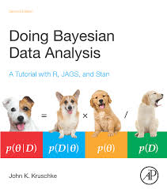
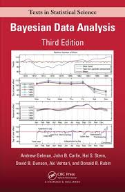
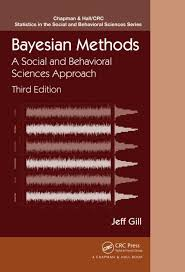

```{r setup, include=FALSE}
knitr::opts_chunk$set(echo = FALSE, warning = F, message = F, fig.height = 4, fig.width = 5)
```


## Opis warsztatu

|            |                                              |
|------------|----------------------------------------------|
| D1/10:00   | Wprowadzenie do statystyki Bayesowskiej      |
| D1/11:45   | Powtórka z R                                 |
| D1/14:00   | Wprowadzenie do MCMC                         |
| D1/15:45   | brms: regresja prosta i porównywanie średnich|
|            |                                              |
| D2/10:00   | brms: regresja wielokrotna + a. moderacji    |
| D2/11:45   | brms: Bayesowska ANOVA                       |
| D2/14:00   | brms: Bayesowski HLM                         |
| D2/15:45   | Testowanie hipotez i porównywanie modeli     |

## Opis oprogramowania

- R + RStudio + RStudio Noteboooks
- pakiety:
  - tidyverse
  - brms
  - emmeans
  - bayestestR
  - tidybayes
  
## Strona warsztatu

- Wszystkie materiały, skrypty R, oraz dane można pobrać ze strony:
  - [https://github.com/wsoral/bayes_warsztat2019](https://github.com/wsoral/bayes_warsztat2019)
  
## Inne programy oferujące metody Bayesowskie

- Większość współczesnych pakietów statystycznych oferuje jakiś rodzaj metod Bayesowskich:
  - Stata
  - SAS
  - MPlus
  - SPSS/Amos
  - JASP
  - WinBUGS
  - JAGS
  - Python - Pymc3
  - Julia - Turing

## Książki na temat analizy Bayesowskiej


## Książki na temat analizy Bayesowskiej



## Książki na temat analizy Bayesowskiej



## Książki na temat analizy Bayesowskiej



## Książki na temat analizy Bayesowskiej


## Materiały dostępne online:

- Blogi na temat pakietu `brms`: [tutaj](https://paul-buerkner.github.io/blog/brms-blogposts/)
- Case studies z użyciem programu `Stan`: [tutaj](https://mc-stan.org/users/documentation/case-studies.html)
- Przykłady z książki 'Statistical rethinking' w `brms`: [tutaj](https://bookdown.org/connect/#/apps/1850/access)
- Przykłady z książki 'Introduction to Mediation, Moderation, and Conditional Process Analysis' Andrew Hayesa w `brms`: [tutaj](https://bookdown.org/connect/#/apps/1523/access)
- Przykłady z książki 'DBDA2ed' Kruscke'go w `brms`: [tutaj](https://bookdown.org/ajkurz/DBDA_recoded/)


## Twierdzenie Bayesa

$$Pr(A | B) = \frac{Pr(B | A) \times Pr(A)}{Pr(B)}$$

## Twierdzenie Bayesa

>- Jak bardzo możemy być pewni statystycznie istotnego wyniku...
>- jeżeli przeprowadziliśmy badanie o mocy .80 i uzyskaliśmy istotny statystcznie wynik, p < .05?
>- Moc .80 oznacza, że jeżeli nasza hipoteza (H1 = prawda) jest prawdziwa, na 1000 badań w 800 uzyskamy istotny wynik.
>- Wartość p oznacza, że jeżeli nasza hipoteza jest fałszywa (H0 = prawda), na 1000 badań w 50 uzyskamy istotny wynik.
>- Nie wiemy jak dużo hipotez badawczych jest prawdziwe. Przypuśćmy, że jest to jednak tylko mały odsetek, 10 na 1000.
>- Jakie jest prawdopodobieństwo, że nasza hipoteza jest prawdziwa jeżeli uzyskaliśmy istotny wynik?


## Twierdzenie Bayesa

|         |  H0 = prawda | H1 = prawda |
|---------|--------------|-------------|
| p < .05 |              |             |
| p > .05 |              |             |
|         |    **990**   |    **10**   |


## Twierdzenie Bayesa

|         |  H0 = prawda | H1 = prawda |
|---------|--------------|-------------|
| p < .05 |              |      8      |
| p > .05 |              |      2      |
|         |    **990**   |    **10**   |


## Twierdzenie Bayesa

|         |  H0 = prawda  | H1 = prawda |
|---------|---------------|-------------|
| p < .05 |   49.50 (50)  |      8      |
| p > .05 |  941.50 (941) |      2      |
|         |    **990**    |    **10**   |

## Twierdzenie Bayesa

- Na 1000 badań, wśród wszystkich 58 istotnych testów statystycznych
  - 8 jest przejawem tego, że nasza hipoteza jest prawdziwa
  - 50 wynika z przypadku
- Prawdopodobieństwo, że nasza hipoteza jest prawdziwa wynosi: 8/58 = 0.137931


## Twierdzenie Bayesa

- `+` = p < .05
- `-` = p > .05

$$Pr(H_1 | p < +) = \frac{Pr(+ | H_1) \times Pr(H_1)}{[Pr(+ | H_1) \times Pr(H_1)] + [Pr(+ | H_0) \times Pr(H_0)]}$$

## Twierdzenie Bayesa

$$Pr(H_1 | p < .05) = \frac{.80 \times .01}{[.80 \times .01] + [.05 \times .99]} \approx .14$$

## Jak szybko policzyć Pr dla H1?

[When does a significant p-value indicate a true effect?](http://shinyapps.org/apps/PPV/)

## Zastosowanie twierdzenia Bayesa w modelowaniu statystycznym

$$Posterior = \frac{Likelihood \times Prior}{Average\ Likelihood}$$


## Zastosowanie twierdzenia Bayesa w modelowaniu statystycznym

$$Pr(parametry | dane) = \frac{Pr(dane | parametry) \times Pr(parametry)}{Pr(dane)}$$

## Zastosowanie twierdzenia Bayesa w modelowaniu statystycznym

$$Pr(\theta| \mathcal{D}) = \frac{Pr(\mathcal{D} | \theta) \times Pr(\theta)}{\int Pr(\mathcal{D} | \theta) \times Pr(\theta) \mathrm{d}\theta}$$

## Wnioskowanie Bayesowskie

- Przypuśćmy, że chcemy oszacować ile osób w populacji ma specyficzny profil osobowości.
- Dysponujemy kwestionariuszem, który mierzy taki profil bezbłędnie.
- Zaczynamy badanie na losowej, reprezentatywnej próbie osób.
- Otrzymujemy po kolej wyniki (P = pozytywne lub N = negatywne)
- P, N, N, P, P, N, N, N, N, N

## Wnioskowanie Bayesowskie

```{r}
library(tidyverse)
ggplot(data.frame(p = seq(0,1, length.out = 100)), aes(x=p))+
  stat_function(fun = function(x) dbeta(x, 1,1), size=1.5, linetype=2)+
  stat_function(fun = function(x) dbeta(x, 2,1), size=1.5, linetype=1)+
  ggtitle("P")+
  labs(y="Prawdopodobieństwo",x="Proporcja osób o specyficznym profilu")+
  ggpubr::theme_pubr()+
  theme(axis.text.y = element_blank())
```

## Wnioskowanie Bayesowskie

```{r}
library(tidyverse)
ggplot(data.frame(p = seq(0,1, length.out = 100)), aes(x=p))+
  stat_function(fun = function(x) dbeta(x, 2,1), size=1.5, linetype=2)+
  stat_function(fun = function(x) dbeta(x, 2,2), size=1.5, linetype=1)+
  ggtitle("P N")+
  labs(y="Prawdopodobieństwo",x="Proporcja osób o specyficznym profilu")+
  ggpubr::theme_pubr()+
  theme(axis.text.y = element_blank())
```


## Wnioskowanie Bayesowskie

```{r}
library(tidyverse)
ggplot(data.frame(p = seq(0,1, length.out = 100)), aes(x=p))+
  stat_function(fun = function(x) dbeta(x, 2,2), size=1.5, linetype=2)+
  stat_function(fun = function(x) dbeta(x, 2,3), size=1.5, linetype=1)+
  ggtitle("P N N")+
  labs(y="Prawdopodobieństwo",x="Proporcja osób o specyficznym profilu")+
  ggpubr::theme_pubr()+
  theme(axis.text.y = element_blank())
```


## Wnioskowanie Bayesowskie

```{r}
library(tidyverse)
ggplot(data.frame(p = seq(0,1, length.out = 100)), aes(x=p))+
  stat_function(fun = function(x) dbeta(x, 2,3), size=1.5, linetype=2)+
  stat_function(fun = function(x) dbeta(x, 3,3), size=1.5, linetype=1)+
  ggtitle("P N N P")+
  labs(y="Prawdopodobieństwo",x="Proporcja osób o specyficznym profilu")+
  ggpubr::theme_pubr()+
  theme(axis.text.y = element_blank())
```

## Wnioskowanie Bayesowskie

```{r}
library(tidyverse)
ggplot(data.frame(p = seq(0,1, length.out = 100)), aes(x=p))+
  stat_function(fun = function(x) dbeta(x, 3,3), size=1.5, linetype=2)+
  stat_function(fun = function(x) dbeta(x, 4,3), size=1.5, linetype=1)+
  ggtitle("P N N P P")+
  labs(y="Prawdopodobieństwo",x="Proporcja osób o specyficznym profilu")+
  ggpubr::theme_pubr()+
  theme(axis.text.y = element_blank())
```

## Wnioskowanie Bayesowskie

```{r}
library(tidyverse)
ggplot(data.frame(p = seq(0,1, length.out = 100)), aes(x=p))+
  stat_function(fun = function(x) dbeta(x, 4,3), size=1.5, linetype=2)+
  stat_function(fun = function(x) dbeta(x, 4,4), size=1.5, linetype=1)+
  ggtitle("P N N P P N")+
  labs(y="Prawdopodobieństwo",x="Proporcja osób o specyficznym profilu")+
  ggpubr::theme_pubr()+
  theme(axis.text.y = element_blank())
```

## Wnioskowanie Bayesowskie

```{r}
library(tidyverse)
ggplot(data.frame(p = seq(0,1, length.out = 100)), aes(x=p))+
  stat_function(fun = function(x) dbeta(x, 4,4), size=1.5, linetype=2)+
  stat_function(fun = function(x) dbeta(x, 4,5), size=1.5, linetype=1)+
  ggtitle("P N N P P N N")+
  labs(y="Prawdopodobieństwo",x="Proporcja osób o specyficznym profilu")+
  ggpubr::theme_pubr()+
  theme(axis.text.y = element_blank())
```

## Wnioskowanie Bayesowskie

```{r}
library(tidyverse)
ggplot(data.frame(p = seq(0,1, length.out = 100)), aes(x=p))+
  stat_function(fun = function(x) dbeta(x, 4,5), size=1.5, linetype=2)+
  stat_function(fun = function(x) dbeta(x, 4,6), size=1.5, linetype=1)+
  ggtitle("P N N P P N N N")+
  labs(y="Prawdopodobieństwo",x="Proporcja osób o specyficznym profilu")+
  ggpubr::theme_pubr()+
  theme(axis.text.y = element_blank())
```

## Wnioskowanie Bayesowskie

```{r}
library(tidyverse)
ggplot(data.frame(p = seq(0,1, length.out = 100)), aes(x=p))+
  stat_function(fun = function(x) dbeta(x, 4,6), size=1.5, linetype=2)+
  stat_function(fun = function(x) dbeta(x, 4,7), size=1.5, linetype=1)+
  ggtitle("P N N P P N N N N")+
  labs(y="Prawdopodobieństwo",x="Proporcja osób o specyficznym profilu")+
  ggpubr::theme_pubr()+
  theme(axis.text.y = element_blank())
```

## Wnioskowanie Bayesowskie

```{r}
library(tidyverse)
ggplot(data.frame(p = seq(0,1, length.out = 100)), aes(x=p))+
  stat_function(fun = function(x) dbeta(x, 4,7), size=1.5, linetype=2)+
  stat_function(fun = function(x) dbeta(x, 4,8), size=1.5, linetype=1)+
  ggtitle("P N N P P N N N N N")+
  labs(y="Prawdopodobieństwo",x="Proporcja osób o specyficznym profilu")+
  ggpubr::theme_pubr()+
  theme(axis.text.y = element_blank())
```


## Modele Bayesowskie są proste

Pr. posterior $\propto$ dane przy założeniu hipotez $\times$ Pr. prior

## Modele Bayesowskie są proste

```{r}
sequence_length <- 1e3

d <-
  tibble(probability = seq(from = 0, to = 1, length.out = sequence_length)) %>% 
  expand(probability, row = c("flat", "stepped", "Laplace")) %>% 
  arrange(row, probability) %>% 
  mutate(prior = ifelse(row == "flat", 1,
                        ifelse(row == "stepped", rep(0:1, each = sequence_length / 2),
                               exp(-abs(probability - .5) / .25) / ( 2 * .25))),
         likelihood = dbinom(x = 6, size = 9, prob = probability)) %>% 
  group_by(row) %>% 
  mutate(posterior = prior * likelihood / sum(prior * likelihood)) %>% 
  gather(key, value, -probability, -row) %>% 
  ungroup() %>% 
  mutate(key = factor(key, levels = c("prior", "likelihood", "posterior")),
         row = factor(row, levels = c("flat", "stepped", "Laplace"))) 

p1 <-
  d %>%
  filter(key == "prior") %>% 
  ggplot(aes(x = probability, y = value)) +
  geom_line() +
  scale_x_continuous(NULL, breaks = c(0, .5, 1)) +
  scale_y_continuous(NULL, breaks = NULL) +
  labs(subtitle = "prior") +
  theme(panel.grid       = element_blank(),
        strip.background = element_blank(),
        strip.text       = element_blank()) +
  facet_wrap(row ~ ., scales = "free_y", ncol = 1)

p2 <-
  d %>%
  filter(key == "likelihood") %>% 
  ggplot(aes(x = probability, y = value)) +
  geom_line() +
  scale_x_continuous(NULL, breaks = c(0, .5, 1)) +
  scale_y_continuous(NULL, breaks = NULL) +
  labs(subtitle = "likelihood") +
  theme(panel.grid       = element_blank(),
        strip.background = element_blank(),
        strip.text       = element_blank()) +
  facet_wrap(row ~ ., scales = "free_y", ncol = 1)

p3 <-
  d %>%
  filter(key == "posterior") %>% 
  ggplot(aes(x = probability, y = value)) +
  geom_line() +
  scale_x_continuous(NULL, breaks = c(0, .5, 1)) +
  scale_y_continuous(NULL, breaks = NULL) +
  labs(subtitle = "posterior") +
  theme(panel.grid       = element_blank(),
        strip.background = element_blank(),
        strip.text       = element_blank()) +
  facet_wrap(row ~ ., scales = "free_y", ncol = 1)

library(gridExtra)

grid.arrange(p1, p2, p3, ncol = 3)
```


## Główne różnice pomiędzy podejściem bayesowskim a klasycznym

- Co jest stałe a co zmienne?

- **Klasyczne:** Dane są losowe i napływające z ciągłego strumienia, ale parametry są stałe.

- **Bayesowskie:** Dane są obserwowane i dlatego stałe, parametry są nieznane i opisywane przy pomocy rozkładów.

## Główne różnice pomiędzy podejściem bayesowskim a klasycznym

```{r fig.height = 4, fig.width = 6}
library(tidyverse)
tibble(x = 5.4) %>% 
ggplot(aes(x))+
  geom_vline(aes(xintercept=x), size=2, colour = 'lightblue')+
  labs(x='Difference between men and women')+
  scale_x_continuous(limits = c(3,8))+
  ggpubr::theme_pubr()
```

## Główne różnice pomiędzy podejściem bayesowskim a klasycznym

```{r fig.height = 4, fig.width = 6}
tibble(x = rnorm(100, 5.4, 0.4)) %>% 
ggplot(aes(x))+
  geom_density(fill = 'lightblue')+
  labs(x='Difference between men and women', y = 'Density')+
  scale_x_continuous(limits = c(3,8))+
  ggpubr::theme_pubr()
```

## Główne różnice pomiędzy podejściem bayesowskim a klasycznym

- Jak interpretowane jest prawdopodobieństwo?

- **Klasyczne:** Prawdopodobieństwo jest obserwowanym wynikiem serii nieskończonych prób (np. rzutów kostką) przeprowadzonych w jednakowych warunkach.

- **Bayesowskie:** Prawdopodobieństwo jest miarą przekonań badacza przed i po zebraniu danych.

## Główne różnice pomiędzy podejściem bayesowskim a klasycznym

```{r fig.height = 4, fig.width = 6}
trials <- c(-1,0,0,1,1,1,2,2,2,2,3,3,3,3,4,4,4,5,5,6)
trials %>% 
  enframe() %>% 
  ggplot(aes(trials))+
  geom_dotplot(alpha = 1/4)+
  geom_point(data=data.frame(x=2,y=0.026), aes(x,y), size=5)+
  labs(x="Difference between men and women")+
  scale_x_continuous(breaks =-1:6)+
  ggpubr::theme_pubr()+
  theme(axis.ticks.y = element_blank(),
        axis.text.y = element_blank())
```

## Główne różnice pomiędzy podejściem bayesowskim a klasycznym

```{r fig.height = 4, fig.width = 6}
trials <- -1:6

trials %>% 
  enframe() %>% 
  mutate(prob = dnorm(trials, 2.5, 1)) %>% 
  ggplot(aes(trials, prob))+
  geom_bar(stat="identity", width= 0.2)+
  labs(x="Difference between men and women", y="Probability")+
  scale_x_continuous(breaks =-1:6)+
  scale_y_continuous(limits = 0:1)+
  ggpubr::theme_pubr()
```

## Główne różnice pomiędzy podejściem bayesowskim a klasycznym

- W jaki sposób podsumowuje się modele?

- **Klasyczne:** Estymacja punktowa i błędy standardowe. Przedziały ufności: 95% CI wskazuje, że 19 na 20 przedział pokrywa prawdziwą wartość parametru.

- **Bayesowskie:** Różne sposoby opisywanie rozkładu parametrów (średnia, mediana, kwartyle). Przedziały wiarygodności (*credible intervals*), oraz HPDI (*highest posterior density intervals*).

## Główne różnice pomiędzy podejściem bayesowskim a klasycznym

```{r fig.height = 4, fig.width = 6}
genSE <- function(n = 100, mu = 2, sd = 1) {
  x = rnorm(n, mu, sd)
  m = mean(x)
  se = sd(x)/sqrt(n)
  list(m, se)
}
set.seed(345)
result <- unlist(replicate(20, genSE(),simplify = T))
result <- as_tibble(matrix(result, nrow=20, byrow = T))
colnames(result) <- c('M','SE')

result %>% 
  rownames_to_column() %>% 
  rename(replication = rowname) %>% 
  mutate(replication = as.numeric(replication)) %>% 
  mutate(lower = M - 1.96*SE, upper = M + 1.96*SE) %>% 
  ggplot(aes(x=M, y=replication))+
  geom_vline(xintercept = 2, colour='lightblue')+
  geom_point()+
  geom_segment(aes(y=replication, yend=replication,
                   x = lower, xend = upper))+
  scale_y_continuous(breaks=1:20)+
  labs(x='Difference between men and women')+
  ggtitle('Replication means and 95% confidence intervals')+
  ggpubr::theme_pubr()
```

## Główne różnice pomiędzy podejściem bayesowskim a klasycznym

```{r fig.height = 4, fig.width = 6}
x = rnorm(200, 2, 1/sqrt(100))

tibble(y="HPDI",
       l1 = quantile(x, probs = 0.025),
       l2 = quantile(x, probs = 0.10),
       l3 = quantile(x, probs = 0.33),
       l4 = quantile(x, probs = 0.66),
       l5 = quantile(x, probs = 0.90),
       l6 = quantile(x, probs = 0.975)) %>% 
  ggplot()+
  geom_segment(aes(y=y, yend=y,
                   x = l1, xend = l6,
                   colour = "95%"), size = 3, lineend = "round")+
  geom_segment(aes(y=y, yend=y,
                 x = l2, xend = l5,
                 colour = "90%"), size = 3, lineend = "round")+
  geom_segment(aes(y=y, yend=y,
                 x = l3, xend = l4,
                 colour = "66%"), size = 3, lineend = "round")+
  labs(x='Difference between men and women', y="",
       colour="")+
  ggtitle('Bayesian Intervals')+
  scale_color_brewer(palette = "Set2")+
  ggpubr::theme_pubr()
```

## Główne różnice pomiędzy podejściem bayesowskim a klasycznym

- W jaki sposób odbywa się ogólny proces wnioskowania?

- **Klasyczne:** Poprzez dedukcje z danych przy założeniu, że $H_0$ jest prawdziwa i wcześniejszym ustaleniu wartości $\alpha$. Odrzucenie $H_0$ jeżeli $Pr(dane | H_0) < \alpha$, pozostawienie $H_0$ jeżeli $Pr(dane | H_0) \geq \alpha$.

- **Bayesowskie:** Poprzez indukcję z rozkładu posterior zakładając wcześniejszą wiedzę.


## Główne różnice pomiędzy podejściem bayesowskim a klasycznym

```{r fig.height = 4, fig.width = 6}
tibble(x1=seq(-1.96,1.96, length.out = 100),
       y1=dt(x1, df=8),
       x2=seq(-4,-1.96, length.out = 100),
       y2=dt(x2, df=8),
       x3=seq(1.96,4, length.out = 100),
       y3=dt(x3, df=8)) %>% 
ggplot()+
  geom_area(aes(x=x1,y=y1, fill="H0"), colour="black")+
  geom_area(aes(x=x2,y=y2, fill="H1"), colour="black")+
  geom_area(aes(x=x3,y=y3, fill="H1"), colour="black")+
  annotate("text",x=1.96, y=dt(1.96,8)+0.01, label = "Critical p-value = .05")+
  annotate("text",x=-1.96, y=dt(1.96,8)+0.01, label = "Critical p-value = .05")+
  geom_vline(xintercept = 3, linetype=1, size=1.5)+
  geom_vline(xintercept = 1.3, linetype=2, size=1.5)+
  scale_fill_brewer(palette = "Set2")+
  labs(x="Difference between men and women", y="", fill="")+
  ggpubr::theme_pubr()
```


## Główne różnice pomiędzy podejściem bayesowskim a klasycznym

```{r fig.height = 4, fig.width = 6}
library(bayestestR)
set.seed(123)
data <- rnorm(1000, 2, 10/sqrt(10))
x <- p_direction(data)
plot(x, show_labels=T)+
  geom_text(aes(x=4, y = 1.3, label="76.3%"), colour="white", size=5)+
  geom_text(aes(x=-1.3, y = 1.3, label="23.7%"), colour="white", size=5)+
  ggpubr::theme_pubr()+
  labs(x="Differences between men and women")+
  scale_fill_brewer(palette = "Set2")
```

## Główne różnice pomiędzy podejściem bayesowskim a klasycznym

```{r fig.height = 4, fig.width = 6}
x2 <- rope(data, range = c(-1,1))
plot(x2, show_labels=T)+
  ggpubr::theme_pubr()+
  labs(x="Differences between men and women")+
  scale_fill_brewer(palette = "Set2")
```


## Główne różnice pomiędzy podejściem bayesowskim a klasycznym

```{r fig.height = 4, fig.width = 6}
prior <- distribution_cauchy(1000, 0, scale = 1/sqrt(2))
posterior <- distribution_normal(1000, mean = 2, sd = 7/sqrt(100))
bf <- bayesfactor(posterior, prior=prior)
plot(bf)+
  ggpubr::theme_pubr()+
  scale_color_brewer(palette= "Set2")+
  scale_fill_brewer(palette = "Set2")+
  labs(x="Differences between men and women")+
  ggtitle("Bayes Factor, BF = 45.28")
  
```


## Główne różnice pomiędzy podejściem bayesowskim a klasycznym

- W jaki sposób testowana jest jakość modelu?

- **Klasyczne:** Błędy I i II rodzaju. Wielkość efektu i moc testu. Skupienie na wartości p.

- **Bayesowskie:** Testy predykcyjne (*posterior predictive checks*). Sprawdzenie czułości modelu na różne formy rozkładu prior. Czynnik Bayesa, kryteria informacyjne (DIC, WAIC, LOOIC).

## Dlaczego NIE stosować wnioskowania Bayesowskiego?

- Zależy nam przede wszystkim na stwierdzeniu "istotności" efektu, a nie oszacowaniu jego wagi.
- Nie dysponujemy komputerem lub nasz komputer jest bardzo powolny. 
- Zależy nam na zautomatyzowanych procedurach, jak z książki kucharskiej.

## Dlaczego stosować wnioskowanie Bayesowskie?

- Chcemy być ostrożni przy formułowaniu założeń i jesteśmy gotowi do ich obrony.
- Postrzegamy świat w kategoriach probabilistycznych, a nie jako zbiór stałych fenomenów (znanych lub nieznanych).
- Jesteśmy gotowi przyznać, że każdy model statystyczny w historii nauki był subiektywny (opierał się na założeniach przyjętych przez badacza).
- Jeszcze przed przeprowadzeniem badania mamy informacje, które mogą posłużyć na do opisania rozkładu prior; oraz chcemy ich użyć.

## Kiedy wnioskowanie Bayesowskie może być szczególnie przydatne?

- Mamy niewielkie próby, dane zawierają sporo szumu.
- Badane przez nas populacje mają złożoną, hierarchiczną strukturę (np. uczniowie w klasach, klasy w szkołach, szkoły w województwach, itd.).
- Chcemy kontrolować różne źródła niepewności (braki danych, błędy pomiarowe, naruszone założenia, np. heteroskedastyczność, inne niż Normalny rozkłady odpowiedzi, autokorelacja reszt regresji).
- Replikujemy poprzednio zrealizowane badania.
- Chcemy sprawdzić, czy nasze badania potwierdzają hipotezę o braku różnic (lub braku korelacji).
- Chcemy używać naszych modeli nie tylko do inferencji, ale również do predykcji.

## Pytania


